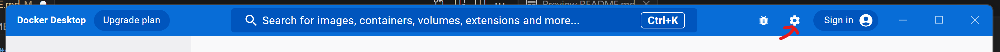

# WSL Bootstrap
This repo is a set of scripts to help with a fresh install of WSL.

It uses the [Ansible package manager](https://docs.ansible.com/) to install some baseline utilities and to configure the environment. It is intended as a tool to help small teams to have a similar setup to their dev environments. As such, it is opionated and makes some broad assumptions about the development environment.

### Ubuntu
This repo is designed to be used with the latest Ubuntu LTS WSL2 distro. At the time of this writing that is Ubuntu 22.04.

### VS Code
VS Code is not required to make use of this repo, but VS Code tasks have been added to make running the install commands easier and the walkthrough is written for a VS Code audience. If you are comfortable using the Linux command line, the scripts live in the repo's `bin` folder.

## Prerequsites
### WSL
The first step is to install the latest Ubuntu WSL distro. The official WSL documentation is [here](https://learn.microsoft.com/en-us/windows/wsl/install).

Run PowerShell as an administrator and run the install command.
```shell
wsl --install
```
This will enable the WSL features. In the same PowerShell, run the command to install Ubuntu 22.04.
```shell
wsl --install -d Unubtu-22.04
```

This should open up an Ubuntu terminal. After installation is complete, you will be prompted to enter a username and password for Ubuntu. Remember the password you enter because it will be needed later.

## Docker Desktop
The next step is to install Docker for Windows. The official install instructions can be found [here](https://docs.docker.com/desktop/install/windows-install/). After downloading and installing Docker, open it up and click the settings cog in the top right.



Afer that navigate to Resources -> WSL Integration. On this screen, enable Ubuntu-22.04 and restart Docker.


## VS Code
Install Visual Studio Code. Once it's installed there are several extension that are needed.

### WSL
This extension makes it seemless to work on a WSL project from Windows.

### Docker
The Docker extension allows you to run containers easily from within VS Code.

### Task Runner
This repository makes use of VS Code custom tasks. The Task Runner plugin provides a convenient interface for running those tasks.

# Install

This repo needs to be installed in the WSL environment. Open up the Ubuntu terminal and clone the repository.

```shell
git clone https://github.com/turtlestackdev/wsl-setup.git
```

Once the repo has been downloadedm cd into the `wsl-setup` directory and run `code .` to start VS Code.

```shell
cd wsl-setup
code .
```

You should see the repo open in VS Code.
Expand the Task Runner section and click `Run WSL Setup`.

